## NodeJs

- URL

>   URL模块提供了用于URL解析和解析的工具
>   调用方式，可以在模块中使用  const url = require('url');

我们想知道Node.js中内置了的模块提供了哪些方法，可以像下面一样

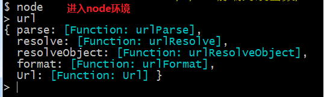

针对我们的一个url地址，有如下的一些属性
以：https://www.imooc.com:8080/video/6710?query=a&page=1#point-1 为例

+ url.parse();

>   传入第一个参数，是一个Url地址，参数二是可选的，Bool,默认是false
>   
>   参数二为true,表示url地址中的query属性总会通过queryString模块的parse()方法生成一个对象。默认为false,则返回的 URL 对象上的 query 属性会是一个未解析、未解码的字符串 如下图url-parse-parameter2

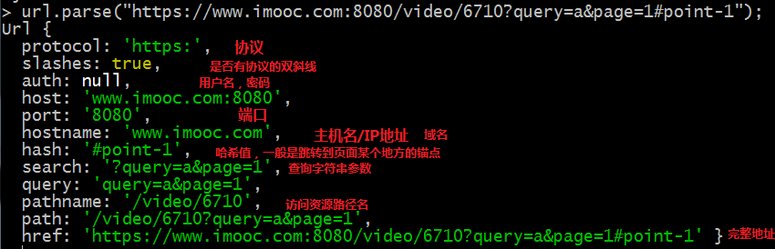

👆图url-parse-parameter2

- url.format({});传出一个可以构建成url的对象，返回的就是一个url链接地址

;

>   url.parse(参数1，参数2，参数3)
>    参数3，如果为 true，则 // 之后至下一个 / 之前的字符串会被解析作为 host。 例如，//foo/bar 会被解析为 {host: 'foo', pathname: '/bar'} 而不是 {pathname: '//foo/bar'}。 默认为 false。
>    
>    //course/lesson-1; --参数3如果为true，会将course解析为host主机，"lesson-1"解析为pathname
>    
>    //course/lesson-1; --参数3如果为false，host主机名为Null,hostName也为null，但是pathname会解析成 "//course/lesson-1"
>   
>   具体需要那种解析方式，看具体需求

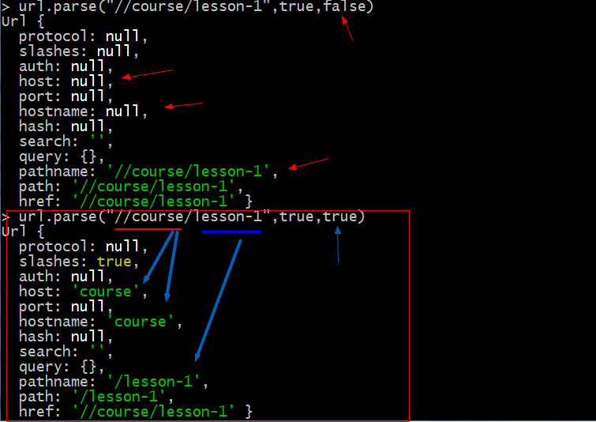;

+ url.resolve(from,to);

>   from <string\> 解析式相对基本的url地址
>   
>   to <string\> 要解析的超链接url

>   url.resolve() 方法会以一种 Web 浏览器解析超链接的方式把一个目标 URL 解析成相对于一个基础 URL。
>   
>   注意： 从基础base的Url到to的url，这里的用户名和密码还是完整的

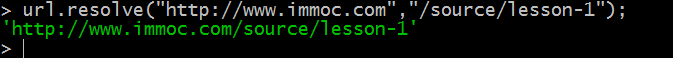;

- querystring 查询字符串

>   上面，我们通过url可以拿到查询字符串，所以，在开发中自然就需要序列化或者反序列化查询参数
>   
>   - querystring.escape(str)
>       + 对给定的 str 进行 URL 编码
>       + 该方法是提供给 querystring.stringify() 使用的，通常不直接使用。 它之所以对外开放，是为了在需要时可以通过给 querystring.escape 赋值一个函数来重写编码的实现。
>       
>   
>   
>   - querystring.parse(参数1，参数2（可选），参数3（可选），参数4（可选）);反序列化
>       +    参数1 那自然是我们的查询字符串了
>       +    参数2 可选的，表示我们查询字符串中间的key-word是用什么分割的，默认是&链接 (图querystring-parse-parameter1)如：'query=node&keyword=nodejs&page=12' 这个查询字符串中间就是用&以示区分(querystring-parse-parameter2图)
>       +   参数3 用于标识每一对查询条件的连接,key-value中间用什么分割；例如name:张三  这里的参数三就是一个":" 当然，也可以使用，name="张三"
        + 参数4 制定解析的那个查询字符串的最大个数，写0，就不限;默认是1000
>      
>   
>   
👆图querystring-parse-parameter1

>   
>   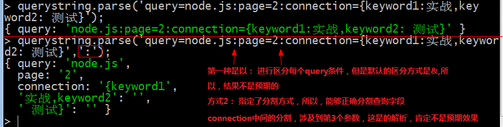
>   
👆图querystring-parse-parameter2

>   
>   如果查询条件是复合类型的，那么，它会将它解析为一个的，就像下面的这个connection，其实是还没解析完全，因为connection解析成为一个key-word，实际还可以往下解析
>   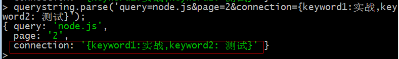
>   
>   - querystring-stringify(参数1，参数2，参数3，参数4); 查询字符串序列化，将查询对象，变成url查询字符串

>       + 参数1：要序列化的字符串对象
        + 参数2：明确查询字符串对象，每一个查询条件用什么分割，默认是&
        + 参数3： 用于确定每一个查询条件中间key-value用什么分割，默认是 =
        + 参数4：一个函数，把对象字符串序列化成查询字符串使用什么函数，默认为 querystring.secape().这个方法通过遍历给定的查询字符串obj,生成url查询字符串
  
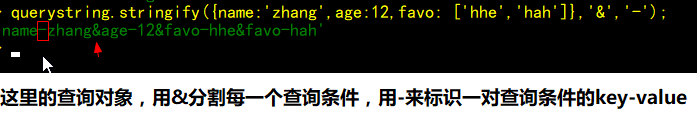
   
- querystring.escape(字符串); 给指定的字符串编码

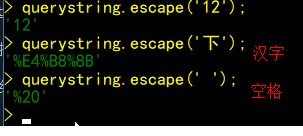

- querystring.unescape(字符串); 给指定的字符串解码

- 读取文件

    + readFile(文件名，编码方式，回调)
    + readFileSync(文件名，编码方式)
    
    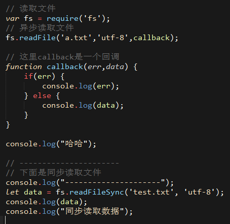
    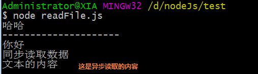

- Node.js的核心模块
    - 全局对象和全局变量
>   js中有一个特殊的对象，它和它所有的属性都能够在程序的任何地方访问，这就全局变量，而这个对象就是全局变量；在浏览器中，我们认为的全局对象是window，而node.js中，global是全局对对象，所有的全局变量，在Node环境中，都是global的属性。

>   global最根本的作用是作为全局变量的宿主对象。满足以下条件的变量是宿主对象

    + 在最外层定义的变量 -node.js不可能在最外层定义全局变量，因为所有的代码都属于当前的模块，以模块的一部分存在，而模块本身不是最外层的上下文。
    + 全局对象的属性
    + 隐士定义的变量（未定义，直接赋值的变量）

    - util函数工具库

        + util.inherits(子类，父类)  -- 实现对象间原型集成的函数

>   node中的工具函数utilinherits的继承方式，子类不会继承构造函数中的属性和方法，只会继承原型上的属性和方法；而console.log()打印父类时，也不会将原型中的内容（属性，方法）打印出来

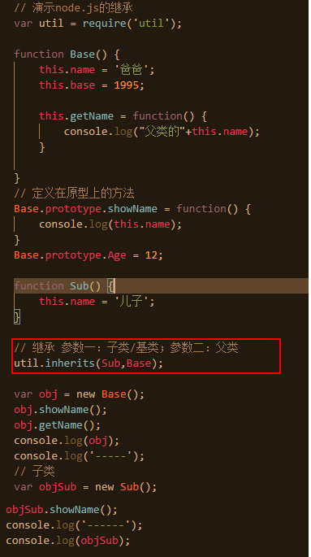; 

结果

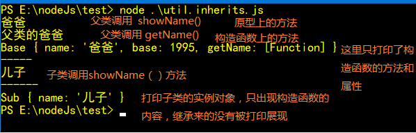;
        
    + util.inspect(对象[,是否显示详情[,显示深度],[在终端显示的颜色]])

>   将一个对象，转换成字符串，这里转换，和直接调用字符串的toString（）方法不同，即使你在对象中定义了toString（）方法，也不会调用(需要看看官网)

-----
# node内部机制

## 模块加载机制

>   node.js通过require（"模块名"）来加载模块

- 模块的类型（分类）

>   核心模块和文件模块。核心模块是node.js官网提供的API，例如fs,http,net,vm等，这都是由官网提供的，已经编译成二进制的。当获取模块遇到与核心模块重名的情况，node.js会优先加载核心模块

>   文件模块是则是存储为单独的文件（或文件夹）的模块，可能是javascript代码，JSON或者编译好的c/c++代码。在加载模块的时候我们大部分没有添加后缀名，默认的加载顺序是： .js>.json>.node(c/c++编译好的文件)

- 按路径加载模块

>   文件模块的加载方式有2种，按路径加载和查找node_modulew文件夹

>   如果以"/"开头，就是以绝对路径查找，例如：'/home/book/module'

>   按照上面说的，优先加载'/home/book/module.js',再是'/home/book/module.json',最后'/home/book/module.node'

>   如果是"./"或"../"等的形式加载,那么以相对路径加载模块。

- 通过查找node_modulem目录加载模块

>   如果require加载的模块既不是核心模块，也不是'/',"./","../"这种按照路径加载的，那么它的查找顺序就是去找node_module目录，去找对应的模块

>   例如： 在require("/home/book/foo.js");调用require("bar.js")模块，就会依次查找 

>   /home/book/node_module/bar.js

>   /home/node_module/bar.js

>   /node_module/bar.js

>注：这样的原因是，通常一个工程中，有很多目录，当子目录需要调用工程的公共模块，就需要向上回溯，一层一层的去找。

- 加载机制

>   node.js的模块不会被重复加载，它会根据实际情况，进行文件名的缓存，只要你2次或多次加载的模块，指向同一个文件，Node只会加载一次。

# 事件驱动

>   为了某个事件注册了回调函数，这个callback不是马上执行，而是等到事件触发才执行，像这种，就是事件驱动
